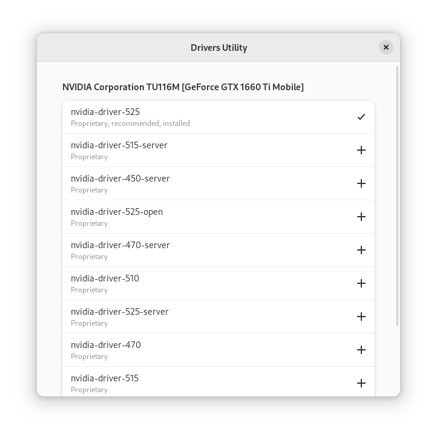

<div align="center">
    
    <h1>Vanilla Drivers Utility</h1>
    <p>A frontend in GTK 4 and Libadwaita for ubuntu-drivers.</p>
    <br />
    
</div>

## Build
### Dependencies
- build-essential
- meson
- libadwaita-1-dev
- gettext
- desktop-file-utils
- ubuntu-drivers-common

### Build
```bash
meson build
ninja -C build
```

### Install
```bash
sudo ninja -C build install
```

## Run
```bash
vanilla-drivers-utility
```
